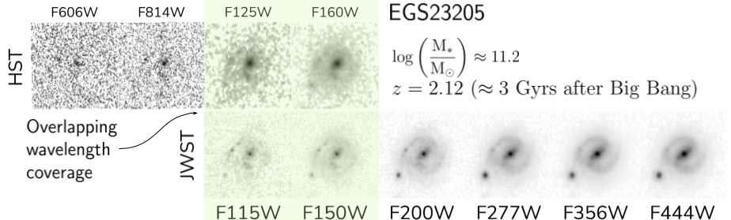

# CEERS EPOCHS MORPHO
Repository for the visual classifications for the June CEERS observations based on the EPOCHS reduction pipeline described in:

The JWST Hubble Sequence: The Rest-Frame Optical Evolution of Galaxy Structure at 1.5<z<6.5
https://arxiv.org/abs/2210.01110

## Visual Classifications Catalog in ``aggregated_classifications.csv`` file
 
 See FIG 2 in the paper for more details.

- ``unique_id``: CANDELS EGS Identifier
- ``num_votes``: How many individual classifiers classified this source
- ``num_good_votes``: How many votes have a disk/peculiar/spheroid classification.
- ``classifiable_frac``: Fraction of classifications that are classifiable
- ``dsk_frac``: Fraction of classifications that assigned disk morphology
- ``sph_frac``: Fraction of classifications that assigned spheroid morphology
- ``pec_frac``: Fraction of classifications that assigned peculiar morphology
- ``smooth_frac``: Fraction of classifications that assigned a smooth light profile to this source (as opposed to structured)
- ``class``: Majority morphological class based on fractions
- ``confident``: If the majority class is unambiguous. False if there is disagreement between classifiers.

## Morfometryka Catalog in ``morphology_morfometryka.csv``

Non-parametric morphologies, Sersic profiles, Sizes and other quantitative estimates extract with Morfometryka (Ferrari et al. 2014).

If you use this dataset we kindly ask to reference it as:

`@ARTICLE{2022arXiv221001110F,
       author = {{Ferreira}, Leonardo and {Conselice}, Christopher J. and {Sazonova}, Elizaveta and {Ferrari}, Fabricio and {Caruana}, Joseph and {Tohill}, Cl{\'a}r-Br{\'\i}d and {Lucatelli}, Geferson and {Adams}, Nathan and {Irodotou}, Dimitrios and {Marshall}, Madeline A. and {Roper}, Will J. and {Lovell}, Christopher C. and {Verma}, Aprajita and {Austin}, Duncan and {Trussler}, James and {Wilkins}, Stephen M.},
        title = "{The JWST Hubble Sequence: The Rest-Frame Optical Evolution of Galaxy Structure at $1.5 < z < 8$}",
      journal = {arXiv e-prints},
     keywords = {Astrophysics - Astrophysics of Galaxies},
         year = 2022,
        month = oct,
          eid = {arXiv:2210.01110},
        pages = {arXiv:2210.01110},
          doi = {10.48550/arXiv.2210.01110},
archivePrefix = {arXiv},
       eprint = {2210.01110},
 primaryClass = {astro-ph.GA},
       adsurl = {https://ui.adsabs.harvard.edu/abs/2022arXiv221001110F},
      adsnote = {Provided by the SAO/NASA Astrophysics Data System}
}
`
